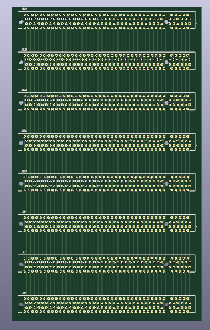

The backplane connects the various boards on the SEM control electronics. I have chosen to use a simple 'dumb' backplane which contains no electronics and simply connects the boards connectors together pin for pin.

